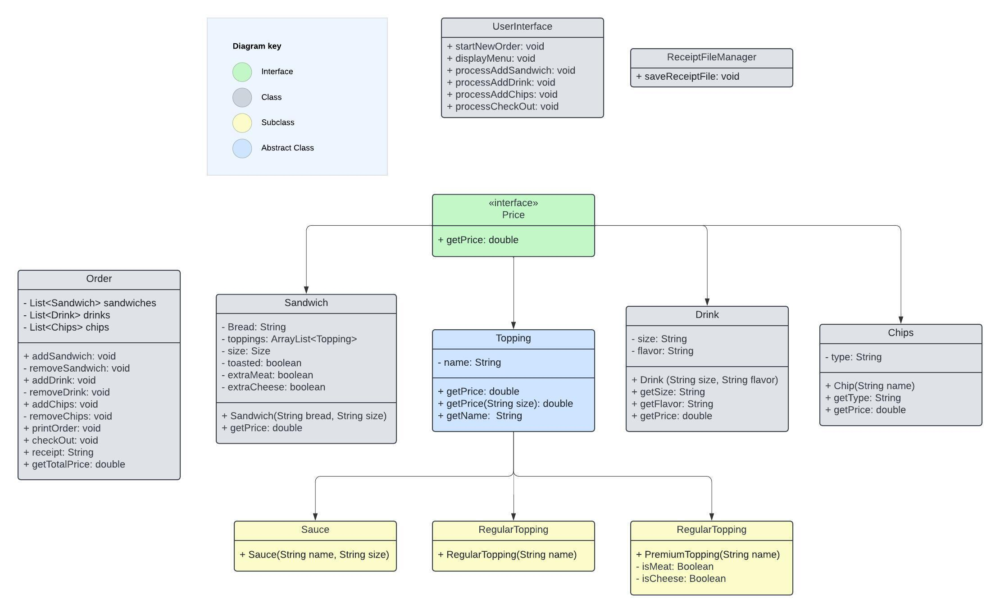
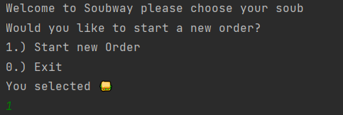
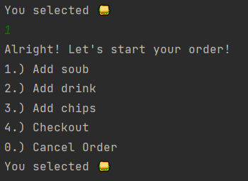

# Soubway 

### Sandwich Shop Menu Project Summary:

This Soubway Shop Menu project is a Java application designed to streamline the ordering process for a 
sandwich shop. The system utilizes a modular and extensible architecture to manage various aspects of 
the menu, pricing, and user interactions. It also records
specific order by time and date making record keeping very easy for both
employees and customers.

----------------------------
#### CLASS DIAGRAM

----------------------------
### User Stories

----------------------------
### Setup

- 
----------------------------
### Technologies Used

- IntelliJ
- Java

----------------------------
### Demo

- Main Menu

- Start of Order

------------------------------
### Future Works

- Expand our food options for customer enjoyment
- Add delivery options on our menu
- Add additional pickup options for UberEats/ Instacart employees

-------------------------------
### Resources
- FreeCodeCamp
- Visual Studio Code

-------------------------------
### Team Soubway
- Jalesia
- Jada
- Sasha
--------------------------------
### Kudos

Special thanks to Raymond for pointing us in the right direction
and challenging us. Kudos to my fellow group mates Jada & Jalesia. We communicated effectively
& helped each other whenever & wherever we could at a time where its so easy to just
put your head down & worry about yourself & im grateful to be a apart of
the BEST TEAM!!!!

