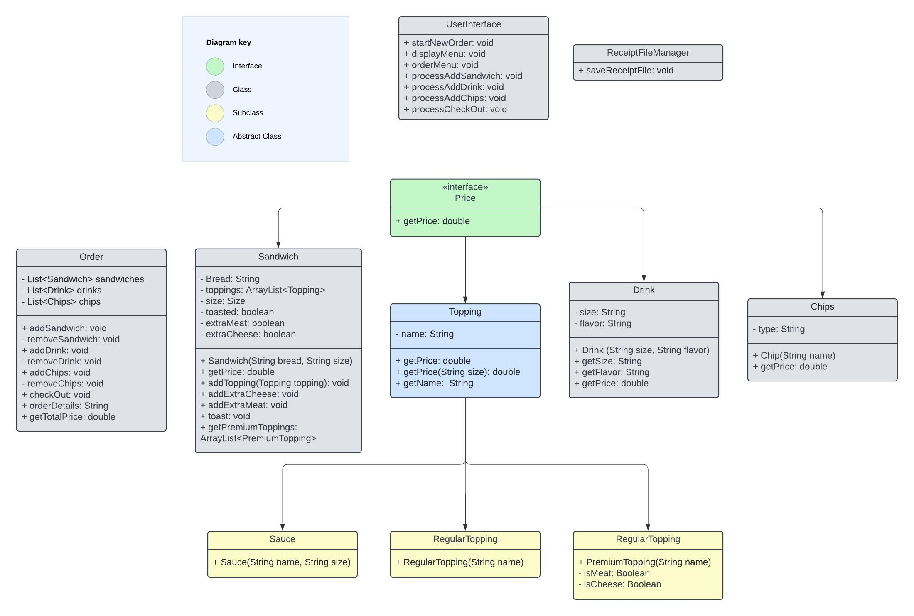

# Soubway 

### Sandwich Shop Menu Project Summary:

This Soubway Shop Menu project is a Java application designed to streamline the ordering process for a 
sandwich shop. The system utilizes a modular and extensible architecture to manage various aspects of 
the menu, pricing, and user interactions. It also records
specific order by time and date making record keeping very easy for both
employees and customers.

----------------------------
#### CLASS DIAGRAM

----------------------------
### User Stories

User stories are testimonials from a targeted end user's perspective.
A user story typically follows this format:

"As a[type of user], I want [an action] so that [benefit/value]."

The examples we'll be listing today are:

----------------------------
### Setup/ How to:

#### In the Terminal:

- First you clone or download this repository to your local device.

- Compile and run Soubway.java
- Create a new branch: git checkout -b feature-branchname
- Make changes/updates to your code, then stage and commit: git add ., git commit -m "Add feature"

And once you've finished these steps you are ready to push your code to GitHub for other 
team members to see. In order to do that follow the steps below:

##### Squash/ Merge

-  Push the branch: git push origin feature-branchname
- On GitHub: Create and merge the pull request using "Squash and Merge"
- Delete the branch on GitHub after merging.
- 
#### In the Terminal:

- Switch to master branch: git checkout master
- Pull latest changes: git pull origin master
- Delete local feature branch: git branch -D feature-branchname

----------------------------
### Technologies Used

- IntelliJ
- Java

----------------------------
### Demo

## Screens
- Main Menu

- Order Menu

- Sandwich Creation

- Chip Selection

- Drink Selection

- Check Out

------------------------------
### Future Works

- Expand our food options for customer enjoyment
- Add delivery options on our menu
- Add additional pickup options for UberEats/ Instacart employees

-------------------------------
### Resources
- FreeCodeCamp
- Visual Studio Code

-------------------------------
### Team Soubway
- Jalesia
- Jada
- Sasha
--------------------------------
### Kudos

Special thanks to Raymond for pointing us in the right direction
and challenging us. Kudos to my fellow group mates Jada & Jalesia. We communicated effectively
& helped each other whenever & wherever we could and im grateful to be a part of
the BEST TEAM!!!!

